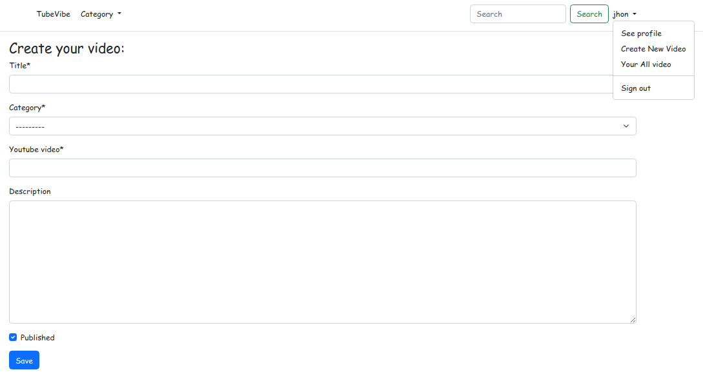
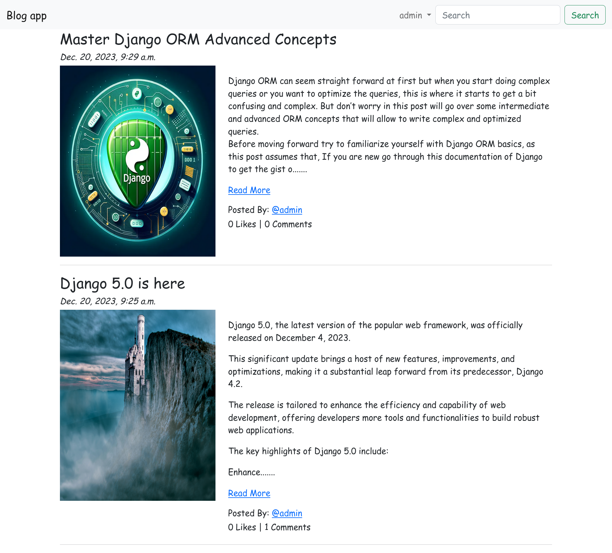
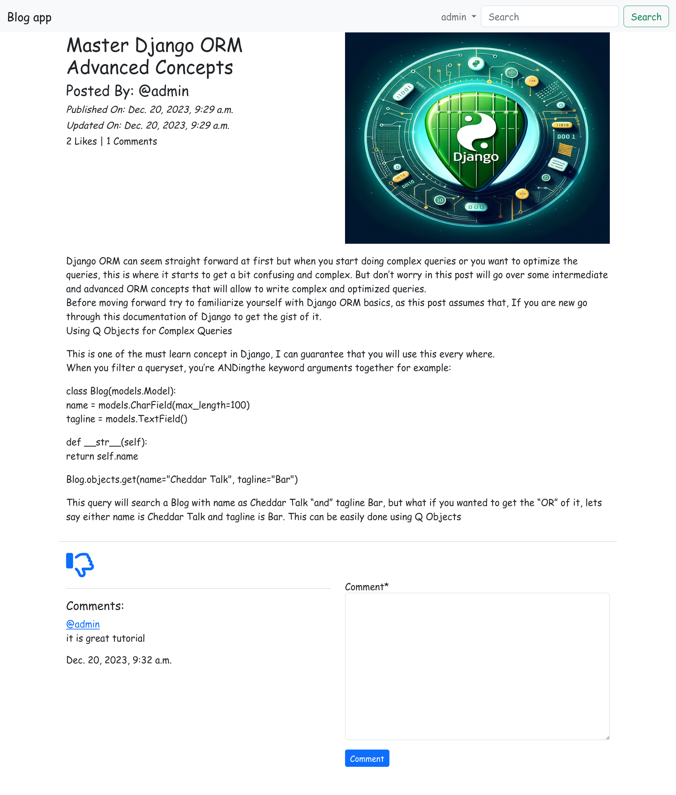
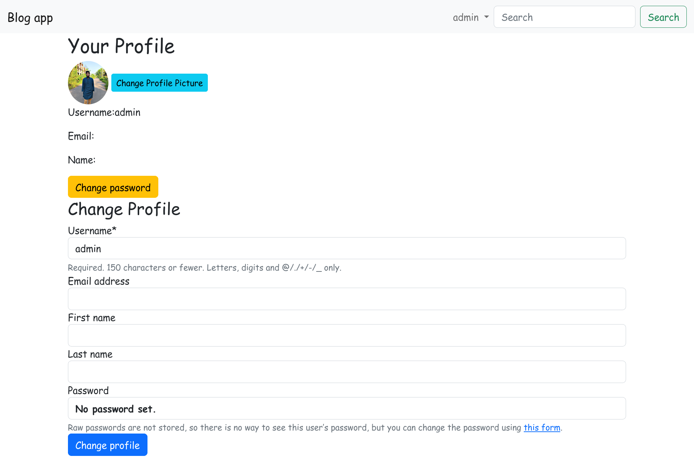
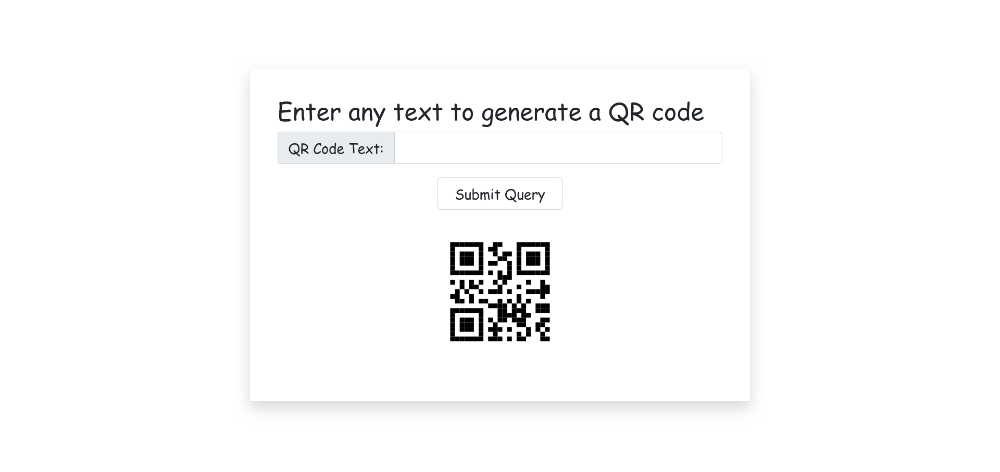
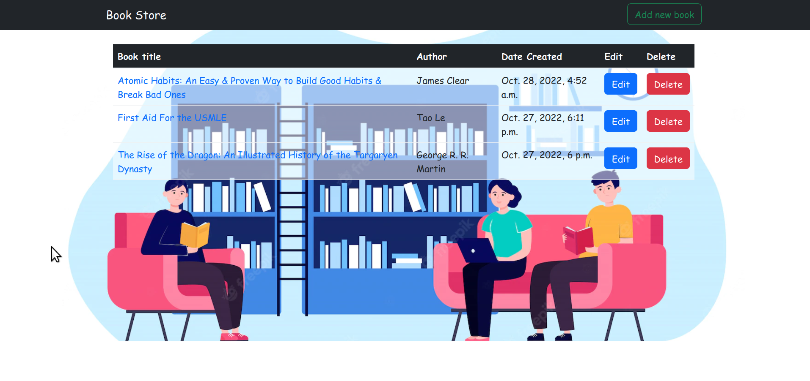
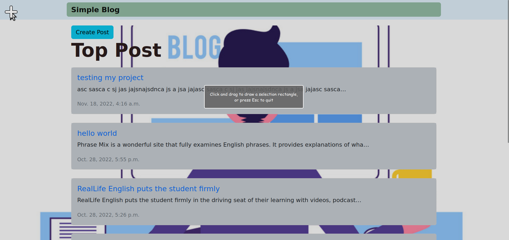
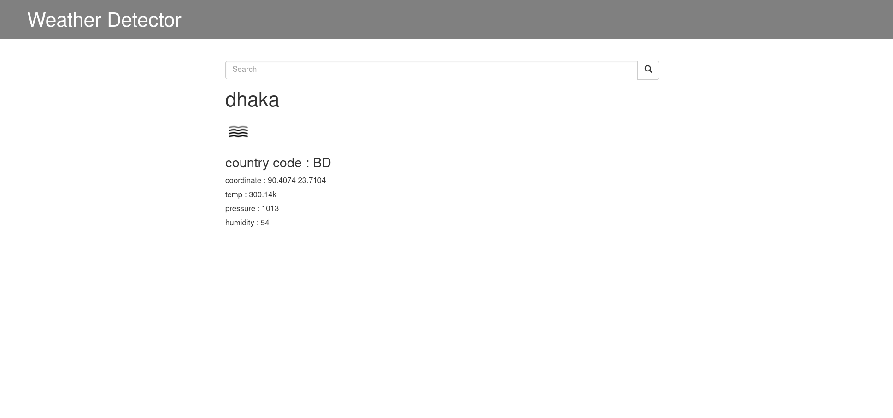

# djangoTestingProject

## Setup
The first thing to do is to clone the repository:


```sh
$ git clone https://github.com/MdAshiqurRahmanZayed/djangoTestingProject.git
$ cd djangoTestingProject/
```
Create a virtual environment to install dependencies in and activate it:

```sh
$ virtualenv test  
$ source test/bin/activate
```
Then install the dependencies:

```sh
(test)$ pip install -r requirements.txt
```
Once `pip` has finished downloading the dependencies:
```sh
(test)$ cd project
(test)$ python manage.py runserver
```
And navigate to `http://127.0.0.1:8000/`
we have to migrate
```sh
$ python manage.py makemigrations 
$ python manage.py migrate 
$ python manage.py createsuperuser
$ python manage.py runserver
```

Demo:<br>
TubeVideo:





Blog:



DJANGO_QR:

BookStore:

SimpleBlog:

weatherdector:
